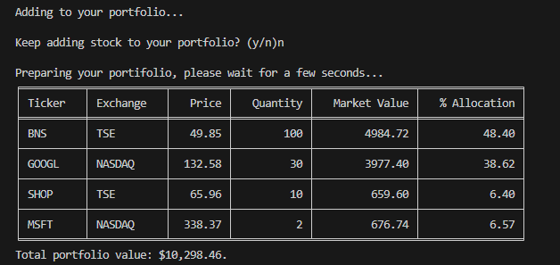

# Stock Portfolio App

## Prerequisites:
### Some necessary libraries required:
`pip install BeautifulSoup, requests, tabulate`

## What can this app do?
Add your stocks owned and have nice view on them as a portfolio summary

NOTE: This currency is automatically converted to USD

## How to use this app?
- Git clone this repo
- Navigate this the folder where the main.py is at
- Type `python main.py` at command line
- Simply type in your owned stocks according to instruction
- Have a nice view on your stcok portfolio :)
